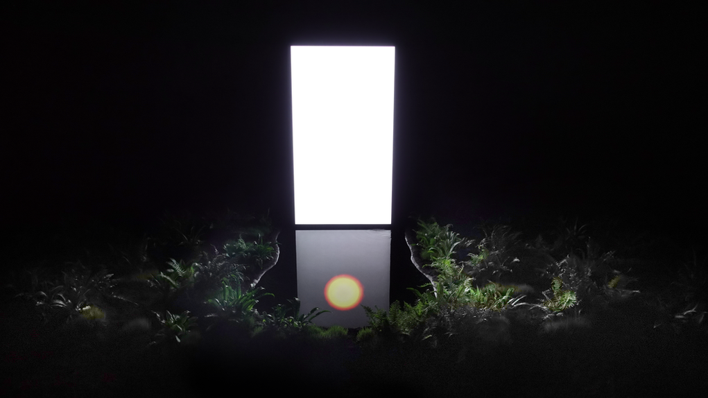
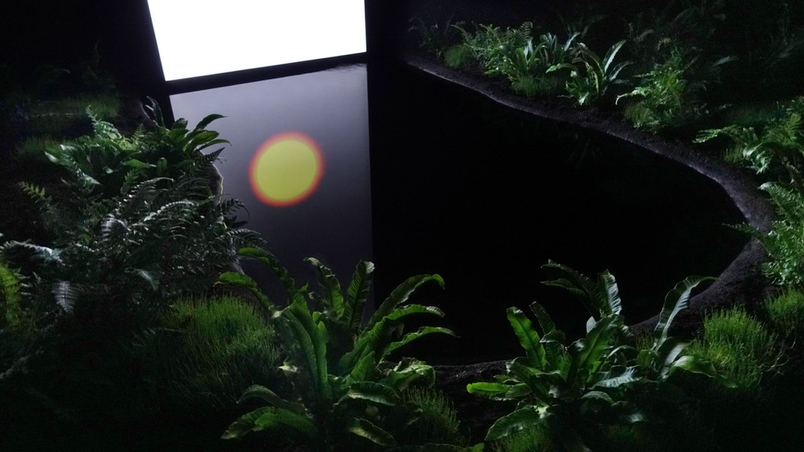
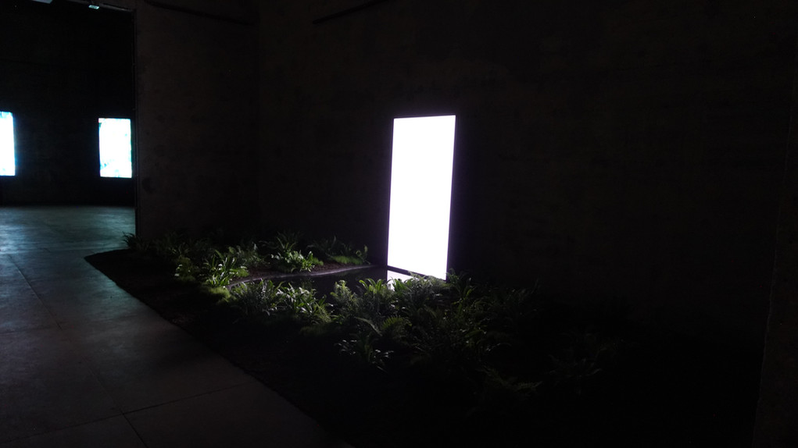

# Présentation de l'œuvre multimédia

## Description

**Set-Rise-Sun** est une installation multimédia qui explore l'interaction entre la technologie, le temps et l'environnement. Composée d'un écran LCD modifié placé perpendiculairement à une surface d'eau dans un cadre naturel, l'œuvre permet aux spectateurs d'observer un Soleil virtuel évoluant du haut vers le bas de l'écran. L'écran, émettant uniquement de la lumière blanche, révèle son contenu uniquement à travers le reflet sur l'eau, qui sert de filtre polarisant naturel en raison du phénomène de l'angle de Brewster.

## Présentation orale du document en ligne
Pour voir la présentation orale en ligne, veuillez suivre ce lien : [URL du document en ligne](https://tristankhadka11.github.io/e1-presentation/#/)

## Informations pertinentes à communiquer

### Qui ?
- **Nom(s) de l'auteur ou des auteurs :** Cinzia Campolese
- 
- **Équipe de production :**
  - **Christophe Gregorio** – Supervision de la production et construction
  - **Camille Marois** – Conception du paysage
- **Collaborateurs et partenaires :** Co-produit par le CALQ et NEW NOW

### Quand ?
- **Date de création :** ...
- **Date de première présentation :** Première présentation en 2023
- **Dates importantes :**
  - Présentée en 2024 au village numérique de MUTEK

### Où ?
- **Lieu de présentation initiale :** festivale NEW NOW
- **Contexte géographique et culturel :** L'œuvre est présentée dans un cadre naturel, utilisant la lumière et le reflet de l'eau pour engager les spectateurs dans une réflexion sur le temps et la technologie.
- **Autres lieux de présentation :**
  - Village numérique de MUTEK

### Quoi ?

  
  
  
  **Set-Rise-Sun** est une œuvre qui combine technologie et nature pour explorer les implications de la gestion du temps par l'homme. Le soleil virtuel visible uniquement via le reflet sur l'eau invite les spectateurs à réfléchir sur l'impact de la technologie sur notre perception du temps et notre relation avec l'environnement.
- **Objectifs de l'œuvre :** Interroger les notions de temps et de contrôle technologique, et encourager la réflexion sur les défis socio-environnementaux actuels.
- **Public cible :** L'œuvre s'adresse à un large public, notamment ceux intéressés par les interactions entre technologie et nature, et ceux préoccupés par les questions environnementales.
- **Aspects techniques :** Écran LCD modifié, bassin d'eau personnalisé, film polarisant, et utilisation de lumière réfléchie.
- **Processus de création :** L'œuvre a été réalisée en modifiant un écran LCD et en le plaçant dans un environnement naturel, où l'eau joue un rôle clé dans la révélation du contenu visuel.

### Comment ?
## Vidéo de l'œuvre

<video width="640" controls>
  <source src="./images/video1.mp4" type="video/mp4">
  Votre navigateur ne supporte pas la vidéo.
</video>

- **Composante centrale :** L'écran LCD modifié et son reflet sur l'eau.
- **Fonctionnement :** Le contenu visuel de l'écran n'est visible que par le reflet sur l'eau, en raison du retrait du film polarisant de l'écran et du phénomène de l'angle de Brewster. Cela permet une interaction unique entre la lumière et l'eau.
- **Matériel utilisé :** 
  - **Écran LCD modifié** : Permet de projeter l'image du Soleil virtuel.
  - **Bassin d'eau personnalisé** : Sert de filtre polarisant naturel pour révéler l'image.
  - **Plantes, sol, sable** : Utilisés pour intégrer l'œuvre dans un environnement naturel et renforcer son impact visuel.
  - **Lecteur multimédia/media player** : Gère la diffusion du contenu visuel sur l'écran.
  - **Son** : Accompagne l'œuvre pour enrichir l'expérience sensorielle.
- **Impact :** Cette approche innovante engage le spectateur à réfléchir sur la gestion du temps et la technologie tout en mettant en évidence notre séparation croissante de la nature.

## Appréciation et commentaire personnel
J'ai choisi **Set-Rise-Sun** en raison de sa manière originale de fusionner technologie et environnement pour aborder des thèmes profonds comme la gestion du temps et notre relation avec la nature. Personnellement, j'apprécie comment l'œuvre utilise la lumière et le reflet de manière créative pour susciter une réflexion sur la façon dont nous percevons et contrôlons le temps. Cette installation invite à une contemplation réfléchie des conséquences de notre dépendance croissante à la technologie et de l'impact que cela peut avoir sur notre environnement naturel.

## Source
[Site officiel de Cinzia Campolese](https://www.cinziac.net/setrisesun)
[Village numérique MUTEK](https://village-numerique.mutek.org/en/installations/set-rise-sun-by-cinzia-campolese)

